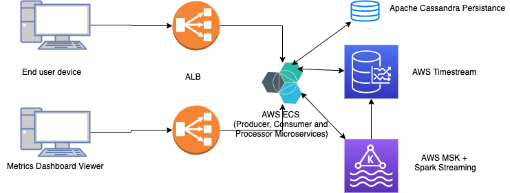

# Google Analytic like backend System

Here is the highlevel architecture of GA like backend system.

## System Flow

1) XHR request made to Analytic system for every user interaction on GA tracking website.

2) Amazon Load balancer routes traffic to the specific data receiver microservice.

3) data receiver puts the data in the MSK Kafka Stream

4) processor microservices uses Apache spark engine to process data and puts data in aws managed time series database called timestream.

5) Microservices uses timestream and relational database for persisting historical data and to reprocess historical data or reload the historical data into kafka stream.

6) producer/Realtime Reporting microservices generates report from the metrics obtained data and sends it to the dashboard client.

## Deduction

### ALB
* Higher throughput
* containerized application support
* Active service monitoring

### ECS
* integrated service discovery

### Microservices
* Decoupling of data reception from data processing
* Dynamically Scalable
* fault-tolerance
* high availablity

### AWS MSK
* handle larage events(read/writes)
* fully managed Apache kafka
* SQL’s Query Flexibility
* Horizontal Write Scalability

### AWS Timestream
* fully managed time series database 
* Built-in analytics

### Apache Cassandra
* to save the aggregated data
* highly scalable
* best read write performance

